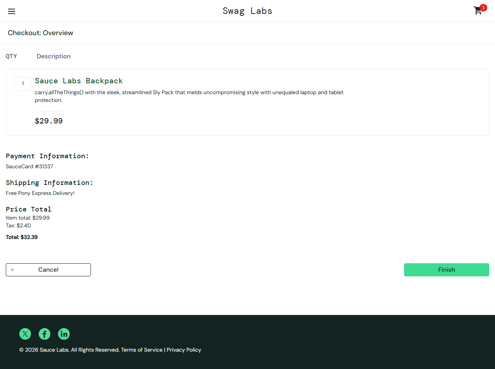
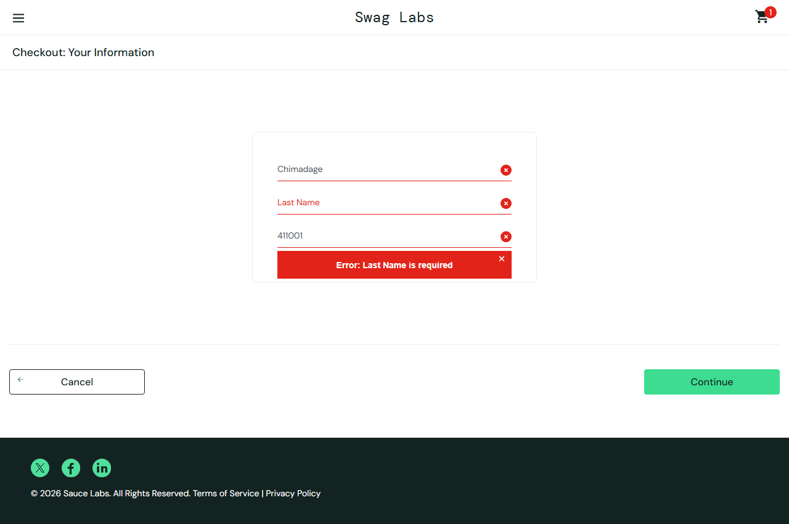
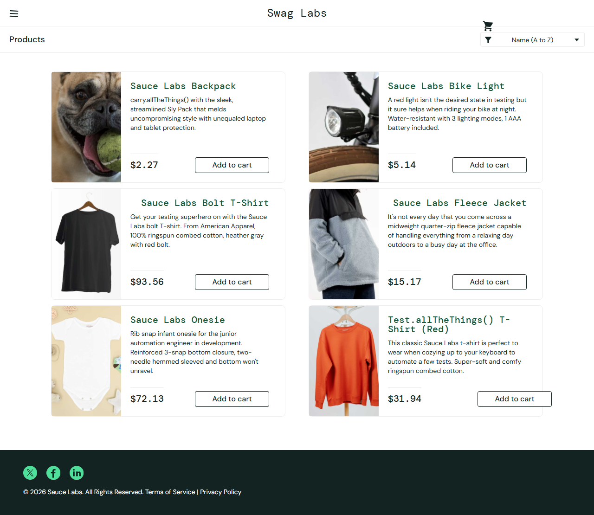
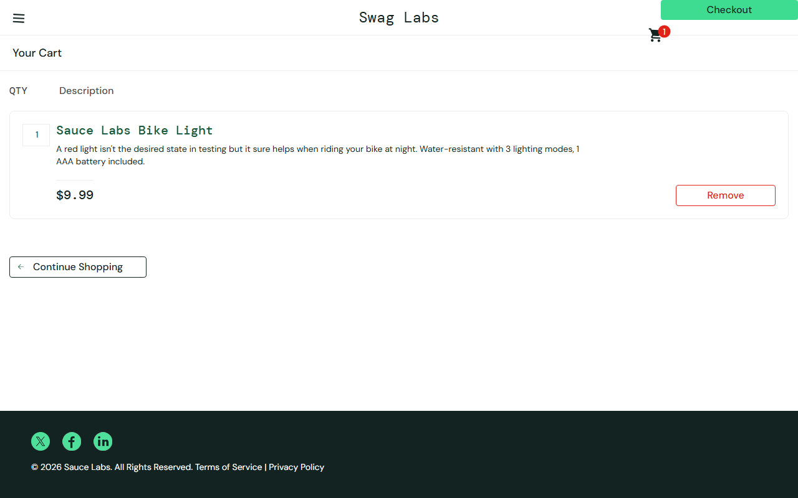
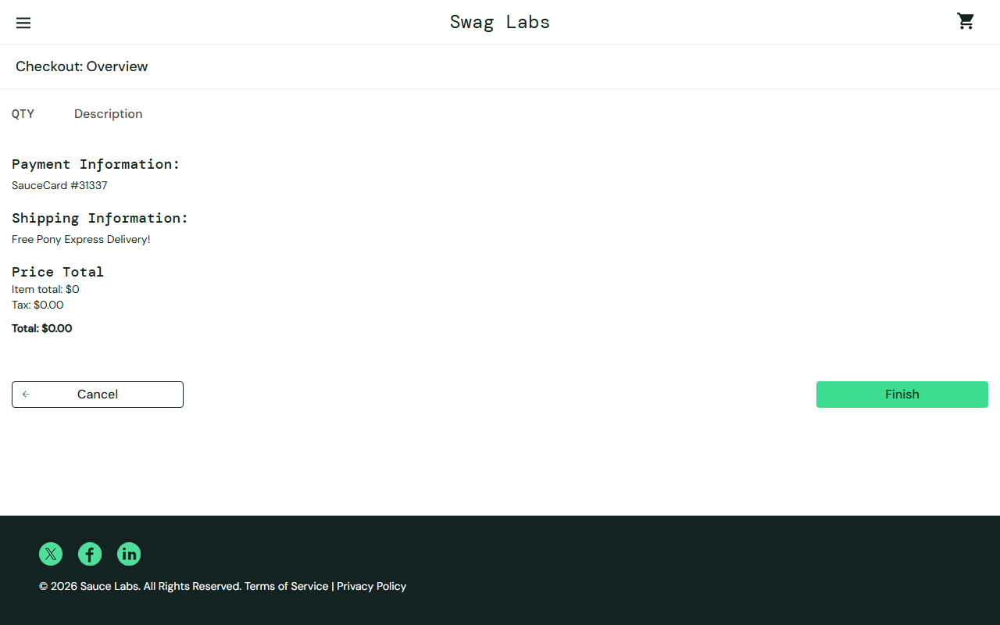
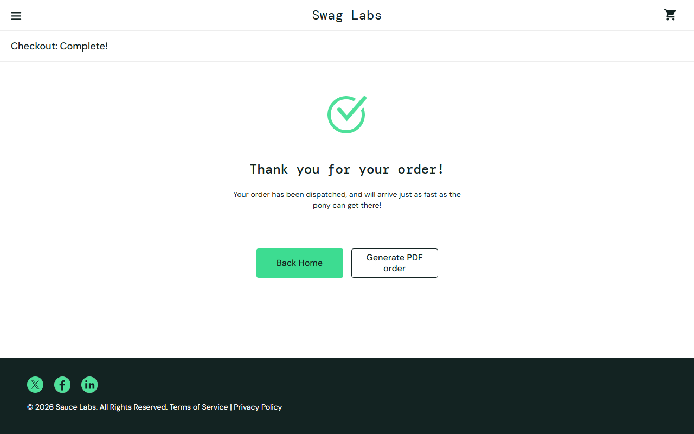

# SQA Engineer — Practical QA & AI Assessment

| | |
|---|---|
| **Application** | SauceDemo — https://www.saucedemo.com/ |
| **Prepared by** | Amol Chimadage |
| **Repository** | https://github.com/AmolchimadagE/SauceDemo-SQA-Assessment |
| **Contents** | Defect report · AI prompt/usage log · Automated test (Playwright) with setup/run instructions · AI-driven QA strategy · Tools list · Evidence |

---

## 1. Executive Summary

SauceDemo, a public e-commerce demo, was tested using risk-based exploratory testing with
AI-assisted test design and validation. Twelve core user journeys were executed against the
live application across four accounts (`standard_user`, `problem_user`, `error_user`,
`visual_user`) in approximately 30 login sessions, using 13 scripted Playwright probes with
continuous console/network capture.

- **AI-assisted exploration:** 5 structured AI prompts for risk analysis, checkout risks,
  UI/accessibility/responsive risks, blind spots, and defect triage. Every suggestion was
  validated by real execution; suggestions referencing features SauceDemo does not have
  (payment gateway, email receipts, inventory backend) were rejected, not fabricated into scope.
- **Defects:** 5 confirmed defects — 2 High (order completion silently failing for
  `error_user`; checkout hard-blocked for `problem_user`), 3 Medium (randomized wrong listing
  prices for `visual_user`; identical placeholder images for `problem_user`; empty-cart orders
  completing) — each reproduced over 3–4 independent sessions with screenshot evidence.
  Additional observations and rejected/unreproduced findings are disclosed separately (§4.3–4.4).
- **Automation:** one isolated end-to-end Playwright/TypeScript test of the complete purchase
  flow, executed 6 times (headless and headed): **6 passed, 0 failed, 0 skipped**, with
  `data-test` selectors, web-first assertions, and zero fixed waits.

All results in this document come from executed commands and observed application behavior.
No defect, screenshot, metric, or execution result is assumed or invented. AI was used as an
engineering assistant; all QA decisions were made through actual testing and human validation.

---

## 2. Application & Test Scope

| Item | Detail |
|---|---|
| Application | https://www.saucedemo.com/ (client-side demo; no payment gateway, no email, no backend inventory) |
| Test account (automation) | `standard_user` / `secret_sauce` (public demo credentials) |
| Additional accounts investigated | `problem_user`, `error_user`, `visual_user`; plus `locked_out_user` and invalid-credential login probes |
| Environment | Chromium 153.0.8010.12 (Playwright-managed) on Windows 11; Playwright 1.63.0, TypeScript 5.9.3, Node.js 20.17.0 |

**High-risk user journeys (prioritized by business impact × likelihood):**

1. **Login** — gateway to all functionality; includes empty/invalid/locked-credential validation.
2. **Product selection** — catalog names, prices, and images drive purchase decisions; sorting as a regression point.
3. **Cart** — add/remove integrity; badge and contents consistency.
4. **Checkout** — multi-field validation, data handling, and price arithmetic (subtotal + 8% tax = total) that must reconcile exactly.
5. **Order completion** — the conversion step; silent failure loses the entire order.
6. **Session/navigation behavior** — reload, back button, logout, deep links (state-leakage risk in SPAs).

**Testing approach:** risk-based manual and scripted exploratory testing across four accounts;
cross-account comparison as the main exploratory axis; AI-generated risks converted into
concrete test charters, each validated by execution; defect triage before reporting; one
happy-path E2E test automated for the flow that passes on `standard_user`.

**Scope limitations:** Chromium only (no Firefox/WebKit); automation covers the happy path for
`standard_user` only; no performance/load/security testing (no backend); accessibility checks
were targeted manual inspections, not a WCAG 2.1 AA conformance audit; no long-duration or
concurrent-session testing; findings reflect the application state observed during this
assessment (public demo, subject to change).

---

## 3. Task A — AI-Assisted Exploratory Testing

### 3.1 Risk-Based Focus

Focus areas were chosen by business impact × likelihood of failure (see §2). AI was used to
generate candidate risks, edge cases, UX/a11y concerns, and blind spots for those areas.
Each AI suggestion fell into one of three paths: **tested and accepted** (became test charters
or defects), **tested and passed**, or **rejected with reason** when the suggestion referenced
capabilities SauceDemo does not have. No AI suggestion was recorded as a finding without
hands-on execution against the live application.

### 3.2 AI Prompt & Usage Log

All prompts were directed to the OpenCode AI assistant (model `big-pickle`) in one working
session; no other AI tools were used. Exact prompt wording is preserved.

| # | Prompt (exact wording) | Purpose | Useful AI output | What was tested | Accepted / Rejected & why |
|---|---|---|---|---|---|
| 1 | "Act as a senior QA engineer. Analyze SauceDemo as an e-commerce application and identify the highest-risk user journeys, business risks, edge cases, and exploratory testing questions." | Establish risk-based focus | Prioritized journeys (login → catalog → cart → checkout → completion); price/image consistency, empty-cart checkout, sorting ties, session persistence | All suggested journeys across 4 accounts; price consistency listing ↔ cart ↔ overview; empty-cart checkout; per-product images; sorting (A–Z, Z–A, price asc/desc incl. $15.99 tie); reload/logout/back | **Accepted:** price consistency → BUG-003; empty-cart checkout → BUG-005; image correctness → BUG-004; sorting and session checks → passed. **Rejected:** stock-decrement and coupon/promo testing — no backend inventory or promotion engine exists; accepting would invent requirements |
| 2 | "Analyze the SauceDemo checkout flow and identify validation, functional, usability, and data-handling risks that should be explored." | Focused checkout risk review | Required-field sequencing; special-char/long/SQL-lookalike input handling; tax arithmetic; empty-cart checkout; deep links; refresh mid-checkout; payment-gateway failure and email receipt checks | Full checkout with special-character, 300-character, and SQL-lookalike inputs; required-field error order; totals arithmetic; empty-cart checkout (repeated); deep-link probes | **Accepted:** empty-cart → BUG-005; validation order, data handling (no XSS, no dialogs), and tax math ($29.99 + $2.40 = $32.39) → passed. **Rejected:** payment gateway and email receipt testing — SauceDemo has no payment step and sends no email; rejected rather than fabricated into scope |
| 3 | "Analyze SauceDemo for UI/UX, accessibility, responsive behavior, and visual risks that are worth validating manually." | Surface visual/a11y/responsive risks | aria labels/roles, keyboard reachability, alt text, headings; 375px/768px overflow/clipping; cross-account image and price comparison | DOM-level checks (labels, `role="alert"` errors, Tab-focus trail), viewport geometry at 375/768px, cross-account image/price diffing | **Accepted:** cross-account comparison → BUG-003 and BUG-004; keyboard, responsive, and error-announcement checks → passed. **Rejected:** full WCAG 2.1 AA conformance claim — only targeted checks were performed; the report claims no more than was verified |
| 4 | "Review the exploratory testing areas for SauceDemo and identify gaps or scenarios a QA engineer might overlook." | Blind-spot detection | Reload persistence; logged-out deep links; back-after-logout; cart persistence across re-login; HTTP status correctness; console/network monitoring; concurrent cart conflicts | Reload on 3 pages, logged-out deep links, back-after-logout, cart persistence across re-login, route status probes, continuous console/network capture | **Accepted:** session/navigation tests → passed (no leakage); route-status check → low-impact observation (§4.3); console monitoring → evidence for BUG-001. **Rejected:** concurrent multi-user cart conflict testing — cart state is client-side only; no shared server resource to conflict |
| 5 | "Review my observed SauceDemo behavior and tell me whether it appears to be a genuine defect, an intentional behavior, or something requiring further investigation. Explain your reasoning." (7 observed behaviors submitted: problem_user checkout field behavior; error_user Finish no-op; visual_user randomized prices; HTTP 404 on valid routes; telemetry 401/CORS errors; one failed cart-removal attempt; empty-cart order completion) | Defect triage before reporting | 4 behaviors + empty-cart order → genuine defects; 404 on SPA routes → hosting fallback → observation; telemetry 401 → placeholder token, no user impact → do not report; single cart-removal failure → insufficient evidence → retest | Each promoted defect re-reproduced in fresh sessions with screenshots; 404/telemetry items impact-analyzed; cart-removal anomaly re-run 3 additional times | **Accepted:** 5 defects promoted to records BUG-001…005; 404 status and telemetry 401 excluded as defects. **Rejected:** filing the cart-removal failure — occurred once, never reproduced (3/3 passes); disclosed as an unreproduced anomaly instead |

---

## 4. Task B — Defect Discovery & Reporting

Severity scale used: Critical = system unusable / data-security impact; High = important
business flow significantly broken; Medium = important functionality incorrect with a
workaround; Low = minor/cosmetic. All defects were reproduced in fresh sessions against the
live application. Environment for all: SauceDemo · Chromium 153.0.8010.12 (Playwright 1.63.0)
· Windows 11.

### 4.1 Defect Summary

| ID | Defect | Severity | Priority | Status |
|---|---|---|---|---|
| BUG-001 | Finish button does not complete order for `error_user` | High | High | Confirmed — 3 sessions / 4 attempts |
| BUG-002 | `problem_user` Last Name field discards input and overwrites First Name | High | High | Confirmed — 3 sessions / 7+ attempts |
| BUG-003 | `visual_user` product listing prices are randomized/incorrect | Medium | High | Confirmed — 4 sessions |
| BUG-004 | `problem_user` product listing images display the same 404 placeholder | Medium | Medium | Confirmed — 3 sessions |
| BUG-005 | Empty cart can complete an order with $0 total | Medium | Medium | Confirmed — 4/4 runs (`standard_user`) |

### 4.2 Detailed Defect Reports

#### BUG-001 — Finish button does not complete order for error_user

| Field | Detail |
|---|---|
| Account / persona | `error_user` |
| Preconditions | Logged in; ≥1 item in cart; on Checkout: Overview with valid customer details entered |
| Reproducibility | 3 sessions / 4 Finish clicks — 100% consistent |
| Severity / Priority | **High / High** |

**Steps to reproduce:**
1. Log in as `error_user`; add Sauce Labs Backpack; open cart; click Checkout.
2. Enter first name "Amol", last name "Chimadage", postal code "411001"; click Continue
   (overview opens; totals display correctly).
3. Click **Finish**.
4. Observe for navigation or error feedback.

**Expected result:** Navigate to `checkout-complete.html` and show "Thank you for your order!".

**Actual result:** No navigation and no visible error; the page stays on "Checkout: Overview"
with the Finish button still present. Each click throws an uncaught console error:
`La.cesetRart is not a function` (minified bundle). `standard_user` completes the same flow
normally in the same environment.

**Business/user impact:** The user supplies all data, reaches the final step, clicks Finish,
and silently loses the order — lost revenue, support tickets, and trust damage. Severity is
High (not Critical) because the failure is account-scoped, not platform-wide, and there is no
data or security impact.

**Why it is considered a defect:** The order-completion step is the conversion point of the
primary business flow; complete silent failure with no feedback is a clear functional defect,
confirmed by a reproducible JavaScript error on every attempt.

**Evidence:**



`screenshots/BUG-001-error-user-finish-stuck.png` (console error text quoted from session logs)

---

#### BUG-002 — problem_user Last Name field discards input and overwrites First Name

| Field | Detail |
|---|---|
| Account / persona | `problem_user` |
| Preconditions | Logged in; ≥1 item in cart (added from the listing page); on Checkout: Step 1 of your information |
| Reproducibility | 3 sessions / 7+ attempts; both programmatic fill and manual typing lose every character |
| Severity / Priority | **High / High** |

**Steps to reproduce:**
1. Log in as `problem_user`; add Sauce Labs Backpack from the **product listing** (listing
   add works); open cart; click Checkout.
2. Enter "Amol" in **First Name**.
3. Enter "Chimadage" in **Last Name**, then observe both fields.
4. Enter "411001" in **Zip/Postal Code** and click **Continue**.

**Expected result:** Each value stays in its own field; Continue advances to the order overview.

**Actual result:** The Last Name field displays **empty immediately after entry** while the
typed text appears in **First Name** (it changes from "Amol" to "Chimadage"). Continue shows
**"Error: Last Name is required"** and remains on step one. Checkout cannot be completed.

**Business/user impact:** No purchase is possible for `problem_user`. The typed name silently
"moves" to another field and vanishes — a functional dead-end plus a data-integrity perception
problem. High (not Critical): other accounts and the rest of the site remain usable; no data
loss or security impact.

**Why it is considered a defect:** A required input discards all typed data and mis-files it
into a different field, permanently blocking the purchase flow with a misleading error —
deterministic and without workaround.

**Evidence:**



`screenshots/BUG-002-problem-user-checkout-lastname.png`

---

#### BUG-003 — visual_user product listing prices are randomized/incorrect

| Field | Detail |
|---|---|
| Account / persona | `visual_user` |
| Preconditions | Logged in as `visual_user`; viewing the product listing |
| Reproducibility | 4 sessions; wrong values differ every session |
| Severity / Priority | **Medium / High** |

**Steps to reproduce:**
1. Log in as `visual_user`; on the inventory listing, note any product's displayed price
   (e.g., Sauce Labs Bike Light).
2. Add the item to cart and note its price in the cart (or open its detail page).
3. Log out, log in again, and repeat step 1.

**Expected result:** One consistent catalog price per product across listing, detail, cart,
and overview, stable across sessions.

**Actual result:** The listing shows different, incorrect amounts for all six products, changing
every session (Bike Light observed at $64.79, $12.42, and $5.14 across three sessions — true
price $9.99). Cart and detail show the correct $9.99 in the same session, and checkout totals
are calculated from the correct price. Evidence run: listing $5.14 vs. cart $9.99 for the same
item in the same session.

**Business/user impact:** Users misjudge affordability (a $9.99 item shown at $64.79 is
effectively hidden; a $49.99 item shown at $2.27 invites disappointment at checkout). Wrong
prices distort purchase decisions and would create pricing-compliance and trust exposure in a
real shop. Severity Medium because the transaction settles correctly and a workaround exists
(check detail/cart); Priority High because it hits the most-visited page on every visit.

**Why it is considered a defect:** Core business data (price) is displayed incorrectly and
inconsistently on the primary browsing page while the same product shows a different correct
price elsewhere in the same session.

**Evidence:**





`screenshots/BUG-003-visual-user-listing-prices.png` · `screenshots/BUG-003-visual-user-cart-correct-price.png`

---

#### BUG-004 — problem_user product listing images display the same 404 placeholder

| Field | Detail |
|---|---|
| Account / persona | `problem_user` |
| Preconditions | Logged in as `problem_user`; viewing the inventory listing |
| Reproducibility | 3 sessions; deterministic |
| Severity / Priority | **Medium / Medium** |

**Steps to reproduce:**
1. Log in as `problem_user`.
2. Observe the product images for all six items on the inventory listing.
3. Inspect the image sources (or compare with `standard_user` in the same environment).
4. Repeat in a new session.

**Expected result:** Each product displays its own image (baseline: `standard_user` loads six
distinct sources such as `sauce-backpack-1200x1500-….jpg`).

**Actual result:** All six `` elements load the identical file `sl-404-Cq1a9k9X.jpg` —
a "404" placeholder graphic (unique source count = 1) — while alt texts remain product-specific
and correct. The product detail page shows the correct image.

**Business/user impact:** Customers cannot visually distinguish products; a catalog where
every tile shows an error placeholder appears broken, undermines trust, and in real commerce
invites mis-selection and returns. Medium/Medium: browsing and merchandising are degraded, but
the purchase flow still works (workaround: rely on titles/text).

**Why it is considered a defect:** Product imagery — the primary visual identification in a
shop — is replaced by an error placeholder for this account, verified against a working
baseline on the same environment.

**Evidence:**


`screenshots/BUG-004-problem-user-placeholder-images.png`

---

#### BUG-005 — Empty cart can complete an order with $0 total

| Field | Detail |
|---|---|
| Account / persona | Any — reproduced with `standard_user` |
| Preconditions | Logged in; cart empty (no badge, no line items) |
| Reproducibility | 4/4 runs |
| Severity / Priority | **Medium / Medium** |

**Steps to reproduce:**
1. Log in; open the cart — the empty cart still shows an enabled **Checkout** button.
2. Click Checkout; enter valid first name, last name, postal code; click Continue.
3. Review the overview: **0 items**, "Item total: $0", "Tax: $0.00", "Total: $0.00".
4. Click **Finish**.

**Expected result:** Checkout should not be allowed with an empty cart (button disabled/hidden
or validation blocks progression); no order confirmation for zero items.

**Actual result:** Every step proceeds normally; the overview shows $0 totals; Finish completes
the order: "Thank you for your order! Your order has been dispatched, and will arrive just as
fast as the pony can get there!".

**Business/user impact:** Invalid order confirmations claiming goods "have been dispatched".
This is a demo application with no server-side order object, so no real financial loss occurs
here — but in a production deployment the same missing guard would yield phantom orders,
fulfillment and support confusion, and an abuse vector. Severity Medium rather than High for
that reason; Priority Medium because it requires the user to attempt checkout with an empty cart.

**Why it is considered a defect:** A core business rule (an order requires at least one item)
is not enforced anywhere in the checkout flow, allowing a confirmed order for zero items.

**Evidence:**





`screenshots/BUG-005-empty-cart-zero-overview.png` · `screenshots/BUG-005-empty-cart-order-complete.png`

### 4.3 Additional Verified Observations (not formalized as defects)

Reproduced and confirmed, but not promoted to full records (assessment cap of 5). Disclosed
rather than hidden.

| # | Observation | Evidence base | Why not a full defect record |
|---|---|---|---|
| OBS-1 | `error_user`: product description missing on the detail page; console logs `Error: This component failed to render!` (name, price, image, add-to-cart render) | 1 deep-dive session, DOM dump + console capture | Impact comparable to OBS/BUG-004 but below the five raised; cap of 5 |
| OBS-2 | `problem_user`: Add to cart from the product detail page has no effect; listing-page add works | 2 sessions | Same account already has two records; workaround exists |
| OBS-3 | `error_user`: Last Name input displays empty although the value is retained (checkout proceeds); typing throws `Cannot read properties of undefined (reading 'value')` | 2 sessions with timestamped error timeline | Checkout still completes; confusing display, not a blocked flow |
| OBS-4 | All valid sub-routes (`inventory.html`, `cart.html`, `checkout-*.html`) return HTTP 404 while rendering correctly (root → 200) | Status probe across 7 URLs plus every page load | No user-visible functional impact; standard SPA static-host fallback; would be logged as Low for hosting/ops |
| OBS-5 | Logged-in users can deep-link directly to `checkout-step-two.html` and `checkout-complete.html` | Direct-goto probes in fresh sessions | No server-side order is created; demo defines no step-guard contract; recorded as a hardening recommendation |

### 4.4 Rejected / Unreproduced Findings (not defects)

- **Telemetry 401/CORS errors** (`events.backtrace.io` with placeholder token): instrumentation
  failure with zero user-facing impact — no UI element depends on it. Rejected as a defect.
- **Single cart-removal failure** (early probe): could not be reproduced — 3/3 clean runs
  afterwards; treated as a test-harness race, disclosed here, not filed.
- **"problem_user cart is broken" hypothesis:** refuted by retest — listing-page add/remove,
  cart contents, and badge all work for `problem_user`.

---

## 5. Task C — AI-Assisted Test Automation

### 5.1 Automated Flow

One isolated end-to-end test (`tests/checkout.spec.ts`):

Login → inventory (6 products) → Sauce Labs Backpack → product details → add to cart → cart →
checkout → checkout information → order overview → finish → confirmation → back home.

**Why this flow was selected:** it is the revenue-critical path identified as highest risk in
Task A and the only journey that can assert *correct* end-to-end behavior — it passes on
`standard_user`, so the test encodes acceptance criteria rather than the defective behaviors of
the other accounts (broken flows are documented as defects, not automated as expectations).
It exercises login, catalog data, cart integrity, checkout validation, price arithmetic, and
order completion in one run.

### 5.2 Framework & Technology

| Aspect | Detail |
|---|---|
| Framework / language | Playwright 1.63.0 (`@playwright/test`) + TypeScript 5.9.3 |
| Runtime / packages | Node.js 20.17.0, npm 11.3.0 |
| Browser project | Chromium (Desktop Chrome), Playwright-managed |
| Configuration | `playwright.config.ts`: `baseURL` https://www.saucedemo.com/, list + HTML reporters, `retries: 1`, `trace: 'on-first-retry'`, `screenshot: 'only-on-failure'`, `video: 'retain-on-failure'`, 30 s test timeout, 5 s assertion timeout, 10 s action / 15 s navigation timeouts |
| Test isolation | Fresh browser context per run (Playwright default fixtures); no shared state; safe to re-run and parallelize |

### 5.3 Locator Strategy

- **Primary:** `[data-test="..."]` attributes for all app-specific elements (username, password,
  login-button, add-to-cart, remove, cart link, checkout fields, continue, finish, totals
  labels, completion messages, back-to-products, item name/price/quantity).
- **Structural classes** (`.inventory_item`, `.cart_item`, `.shopping_cart_badge`) only where
  no `data-test` exists, using `has:` sub-locators for product selection.
- **No XPath selectors. No text-only brittle selectors as primary anchors.**

### 5.4 Assertions

26 web-first (auto-waiting) assertions, verified by static analysis:

- **8** `toHaveURL` — a URL checkpoint at every navigation step (login redirect, inventory,
  product detail, cart, checkout step 1, step 2, completion, back to inventory).
- **11** `toHaveText` / `toContainText` — product name, prices ($29.99), cart badge, quantity,
  page title, totals (`Item total: $29.99`, `Tax: $2.40`, `Total: $32.39` — verified by hand:
  29.99 × 8% = 2.40 → 32.39), completion message ("Thank you for your order!", dispatch text).
- **4** `toHaveCount` — 6 products, 1 cart row, badge present after add, badge cleared (0) at end.
- **3** `toBeVisible` — inventory list, checkout form fields, Remove button.

**Synchronization:** Playwright auto-waiting and web-first assertions only. The test contains
**zero `waitForTimeout` and zero fixed sleeps** (verified by search); **no XPath**.

### 5.5 AI Contribution

- Proposed the test structure (login helper + one linear E2E flow with staged comments).
- Drafted the initial locator set, assertion list, and `playwright.config.ts`.
- Ran a critical review pass over its own draft before execution.

### 5.6 Manual Corrections

All applied before the first run, based on live DOM inspection and real text values:

| AI draft / pattern | Correction | Why |
|---|---|---|
| `toContainText('your order has been dispatched')` — case mismatch vs. actual DOM text | → `'order has been dispatched'` | Would have failed against the real page |
| Summary totals located by CSS classes (`.summary_*`) | → `[data-test="subtotal-label"]` / `tax-label` / `total-label` | Live DOM confirmed stable `data-test` attributes; classes are styling-coupled |
| Cart item name/price via CSS classes | → `[data-test="inventory-item-name"]` / `inventory-item-price` | Same maintainability rationale |
| XPath/text-match locators considered for product selection (`//div[text()=…]`) | → structural `.inventory_item` + `has:` sub-locator | XPath couples to DOM shape and breaks on markup changes |
| Login asserted by URL only | → URL + `.inventory_list` visible + item count = 6 | URL can change without content rendering — weak assertion |
| Fixed waits (`page.waitForTimeout`) in an early draft | → locator-based waiting and web-first assertions; final test contains zero `waitForTimeout` | Arbitrary sleeps add flake and runtime; auto-waiting is reliable |
| Missing "correct product in cart" validation | → added product name, price, and quantity assertions in cart and overview | Core acceptance criteria of the flow |
| Config draft: video always on, retries 0 | → `video: 'retain-on-failure'`, `retries: 1` with `trace: 'on-first-retry'` | Trace-on-first-retry needs ≥1 retry; diagnostics on failure only |

AI output was treated as a draft, never as evidence; every assertion and expected value was
verified against the live application before acceptance.

### 5.7 Setup & Execution

From the repository README (prerequisites: Node.js 20+, npm 11+):

```bash
npm install
npx playwright install chromium
npx playwright test
```

Additional commands:

```bash
npx playwright test --headed            # headed run
npx playwright test tests/checkout.spec.ts
npx playwright show-report              # HTML report
```

### 5.8 Execution Results

Actual results from this assessment (6 executions in this session):

| # | Command | Result |
|---|---|---|
| 1 | `npx playwright test` | 1 passed (test 9.0 s; run 20.2 s) |
| 2 | `npx playwright test --headed` | 1 passed (test 13.9 s; run 19.7 s) |
| 3 | `npx playwright test tests/checkout.spec.ts --headed` | 1 passed (test 10.1 s; run 14.9 s) |
| 4 | `npx playwright test` (stability re-run) | 1 passed (test 9.1 s; run 12.4 s) |
| 5 | `npx playwright test` (stability re-run) | 1 passed (test 4.4 s; run 8.4 s) |
| 6 | `npx playwright test` (final verification after config cleanup) | 1 passed (test 9.2 s; run 14.5 s) |

**Total executions: 6 · Passed: 6 · Failed: 0 · Skipped: 0**

Browser coverage: Chromium only. No additional executions, browsers, or metrics are claimed.

### 5.9 Automation Limitations

- One happy-path E2E test for `standard_user`; negative paths, the three defective accounts,
  and edge cases (empty cart, special characters) are documented manually, not automated —
  automating broken flows would encode defects as expectations.
- Chromium only; Firefox/WebKit not executed.
- No performance, load, or security testing (no backend to exercise).
- Accessibility checks were targeted manual inspections, not a WCAG 2.1 AA conformance audit.
- Findings reflect the application state observed during this assessment window; SauceDemo is
  a public demo that may change without notice.

---

## 6. Task D — AI-Driven QA Approach

**1. Value across the QA lifecycle.** AI is used as a first-pass accelerator: generating
risk-based test charters from a requirement or URL (as with the 5 prompts in §3.2), drafting
exploratory question lists, proposing test structure and assertions (§5.5), and summarizing
failure output. Example: prompt 1 turned a blank scope into a prioritized journey list in
minutes, which was then executed for real.

**2. Human review is mandatory** wherever judgment or truth is required: deciding defect vs.
intended behavior, setting severity/priority against business context, verifying evidence, and
any release-gating decision. Demonstrated here: AI suggested payment-gateway and email-receipt
testing for an application that has neither — accepting it would have fabricated scope; the
404 statuses and telemetry 401 errors needed human impact analysis to avoid false positives.

**3. AI-generated tests enter regression only after review** against a fixed checklist:
stable selectors (`data-test`, never XPath), assertions beyond URL-only checks, no fixed
sleeps, expected values validated against the live app, isolation/re-runnability, and an
actual green run. The §5.6 corrections (case-mismatch, class→`data-test`, URL-only login
assertion) are examples of what review catches; AI code is a draft, never evidence.

**4. Defect analysis support.** AI clusters console errors with reproduction steps and
proposes root causes and record drafts — but every field (steps/expected/actual) must trace to
an executed command. Example: the `La.cesetRart` console error was captured during execution
and tied to BUG-001's reproduction, not asserted by AI.

**5. Coverage analysis support.** AI maps user journeys to existing tests and flags untested
paths (e.g., cross-account flows, empty-cart checkout), which a human then de-duplicates and
reality-checks against what the application actually implements.

**6. Regression optimization.** AI ranks tests by change impact and historical failure
likelihood to prune redundant cases and keep a minimal high-signal gate; for this project that
means the single E2E flow protects the revenue path while defect-prone areas stay under manual
exploration until they are fixed.

**7. CI/CD quality gates.** AI summarises failures and performs first-pass triage (flake vs.
real regression) and risk-based test selection; a human approves any gate that can block a
release. Not exercised here (no pipeline in scope) — noted as the intended operating model.

**8. Risks of AI-assisted testing.** Plausible fabrication (invented defects, fake metrics,
features that do not exist); shared blind spots across models; overfitting tests to
AI-visible DOM details; erosion of tester skill if trust is outsourced.

**9. Mitigations.** Execute everything against the real system; require reproduction counts
and evidence before reporting; reject suggestions that reference absent features; keep humans
as the arbiter of severity and release decisions; log every AI prompt with accepted/rejected
suggestions for auditability (§3.2); review all AI-produced tests with the §5.6 checklist.

---

## 7. Tools Used

| Tool | Version | Role in this assessment |
|---|---|---|
| Playwright (`@playwright/test`) | 1.63.0 | Exploratory probes, defect reproduction, screenshots, E2E automation |
| Chromium | 153.0.8010.12 (Playwright-managed) | Test and exploration browser |
| TypeScript | 5.9.3 | Test scripting language |
| Node.js / npm | 20.17.0 / 11.3.0 | Runtime and package management |
| Git / GitHub | Git 2.47.0 | Version control; repository: https://github.com/AmolchimadagE/SauceDemo-SQA-Assessment |
| OpenCode AI assistant | model `big-pickle` | Risk analysis, exploratory prompts, defect triage, automation review (all prompts logged in §3.2) |
| Browser developer tools (via Playwright) | Console, network, DOM inspection | Console/pageerror capture, image-source and DOM verification, viewport geometry checks |

Not used and not claimed: Jira or any defect tracker, Postman, axe-core, CI/CD pipelines,
cross-browser cloud grids, performance/security tools.

---

## 8. Evidence

All evidence was captured during live reproduction runs. Defect facts (field values, prices,
image sources, console errors) were verified programmatically via DOM and console inspection;
the screenshots below provide the visual record for reviewer confirmation.

| File | Supports | What it shows |
|---|---|---|
| `screenshots/BUG-001-error-user-finish-stuck.png` | BUG-001 | Page still on "Checkout: Overview" after clicking Finish |
| `screenshots/BUG-002-problem-user-checkout-lastname.png` | BUG-002 | "Error: Last Name is required" with empty Last Name and First Name overwritten |
| `screenshots/BUG-003-visual-user-listing-prices.png` | BUG-003 | Randomized incorrect prices on the listing for `visual_user` |
| `screenshots/BUG-003-visual-user-cart-correct-price.png` | BUG-003 | Same session: cart shows the correct $9.99 |
| `screenshots/BUG-004-problem-user-placeholder-images.png` | BUG-004 | Six identical 404 placeholder images on the listing |
| `screenshots/BUG-005-empty-cart-zero-overview.png` | BUG-005 | Order overview: 0 items, $0.00 totals |
| `screenshots/BUG-005-empty-cart-order-complete.png` | BUG-005 | Confirmation page for an empty-cart order |

Console/pageerror text (BUG-001, OBS-1, OBS-3) is quoted in the defect and observation
records because console output cannot be captured in a page screenshot. Automation evidence:
6/6 execution results (§5.8) with Playwright HTML report, trace, screenshot-on-failure, and
video-on-failure enabled in configuration.

---

## 9. Repository

**GitHub:** https://github.com/AmolchimadagE/SauceDemo-SQA-Assessment

The public repository contains the automation and supporting assessment files:

- `tests/checkout.spec.ts` — the automated E2E test (§5)
- `playwright.config.ts`, `package.json`, `package-lock.json` — configuration and dependencies
- `README.md` — setup, run, and coverage instructions (§5.7)
- `AI-USAGE.md` — full AI prompt and usage log (§3.2 detail)
- `assessment-report.md` — full exploratory testing report (raw working document)
- `screenshots/` — defect evidence (§8)
- `.gitignore` — excludes `node_modules/`, test results, and HTML reports

---

## 10. Conclusion

This assessment applied risk-based thinking first: five high-risk journeys were prioritized,
then explored systematically across four user accounts in ~30 sessions. AI was used as an
engineering assistant — for risk generation, blind-spot analysis, triage, and test drafting —
and every AI suggestion was validated by execution, with out-of-scope suggestions explicitly
rejected. Five defects were confirmed with repeated reproduction and screenshot evidence, and
equal discipline was applied to what was *not* reported: an unreproduced anomaly, no-impact
telemetry errors, and features SauceDemo does not have. The automated Playwright/TypeScript
test protects the revenue-critical path with stable `data-test` selectors, 26 web-first
assertions, zero fixed waits, and a 6/6 pass record across headless and headed runs. Together
the deliverables demonstrate practical QA judgment, defect-reporting discipline, and a
measured, human-validated approach to AI-assisted testing.
